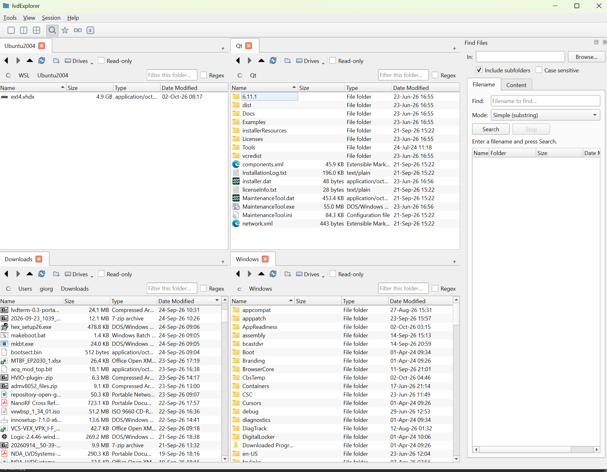
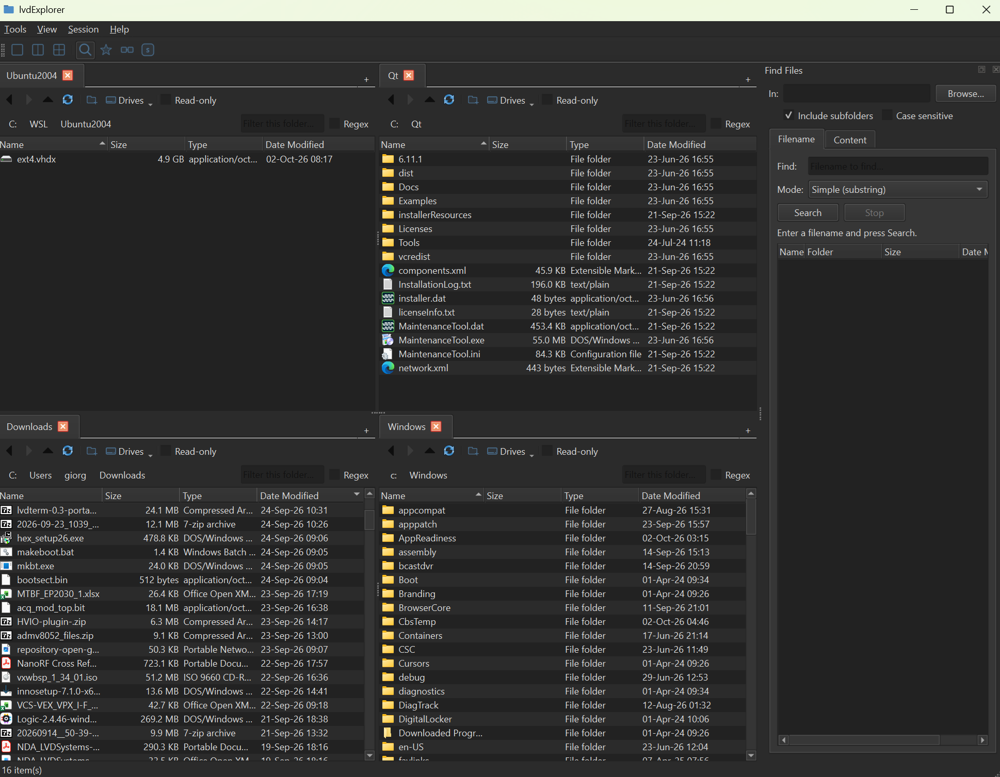
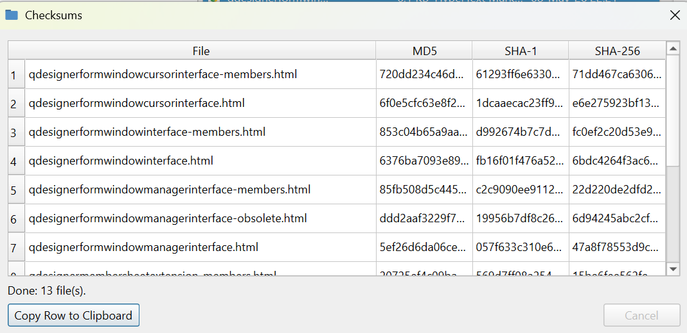

<p align="center">
  
</p>

<h1 align="center">lvdExplorer</h1>

<p align="center">
  An open-source, Qt6-based multi-pane file manager for Windows and Linux, with powerfull integrated search, grep and file hashing.
</p>

<p align="center">
  <a href="https://www.lvdopen.eu">www.lvdopen.eu</a> ·
  <a href="https://www.lvdsystems.eu">www.lvdsystems.eu</a>
</p>




## Features

- **Multi-pane, multi-tab browsing** — 1, 2 (Commander-style side-by-side,
  or stacked), or 4 panes, each with its own tab bar; quick-switch icons
  and `Ctrl+1`/`2`/`3`/`4`.
- **Fast on purpose** — directory scans run off the UI thread and stream
  in as they complete, so a slow network share or a folder with 100k+
  files never freezes the app.
- **Session save/restore** — window layout, every pane's tabs, sort
  order, and columns come back on next launch; named sessions via
  **Session → Sessions...**.
- **Instant filter + threaded Finder** — per-pane substring/regex filter,
  plus a dockable recursive file finder (`Ctrl+F`) that streams results
  as it searches.
- **Real drag & drop** — between panes/tabs and to/from Explorer/Nautilus,
  routed through a cancelable progress queue with a live dialog.
- **Native shell integration (Windows)** — the real `IContextMenu` shell
  menu, Open Terminal Here, native Properties (incl. combined multi-select
  properties), all reachable from the app's own context menu.
- **File ops** — batch rename (pattern or find/replace), MD5/SHA-1/SHA-256
  checksums, folder compare, new folder, all via the same cancelable job
  queue as copy/move/delete.
- **Per-pane read-only lock** — a checkbox that blocks delete/rename/move
  in that pane without a separate "are you sure" for every click.
- **Light/dark theming** and a **keyboard shortcut editor** — every
  shortcut in the app is rebindable, with conflict detection.
- **Ships two ways** — a portable `.zip`/Inno Setup installer on Windows,
  an AppImage on Linux.
- **GPLv3, no telemetry, no accounts.**



## Building

Requires Qt 6.5+ (developed against 6.11.1) and CMake 3.23+.

### Windows (MSVC)

Run from a "x64 Native Tools Command Prompt for VS 2022" (or after calling
`vcvarsall.bat x64`) so `cl.exe` is on `PATH`:

```
cmake --preset windows-msvc
cmake --build --preset windows-msvc
```

The `windows-msvc` preset points `CMAKE_PREFIX_PATH` at
`C:/Qt/6.11.1/msvc2022_64` — edit `CMakePresets.json` (or create a
`CMakeUserPresets.json`, already git-ignored) if your Qt install lives
elsewhere.

### Linux

```
cmake --preset linux
cmake --build --preset linux
```

Requires a system Qt6 (`qt6-base-dev` or equivalent) with `Widgets` on the
CMake package search path. On Debian/Ubuntu:

```
sudo apt-get install cmake ninja-build qt6-base-dev qt6-svg-dev \
    qt6-l10n-tools qt6-tools-dev qt6-tools-dev-tools pkg-config
```

## Testing

```
ctest --test-dir build --output-on-failure
```

Covers the async search engine, the copy/move/delete job queue (including
the read-only-lock rejection paths), folder comparison, and the keyboard
shortcut registry.

## Packaging (Linux)

```
bash packaging/linux/build-appimage.sh
```

Builds Release, downloads `linuxdeploy`/`linuxdeploy-plugin-qt` on first
run (cached under `packaging/linux/tools/`, not vendored), and writes
`lvdExplorer-<version>-x86_64.AppImage` to `dist/`. Needs `curl`,
`pkg-config`, and `file` on `PATH` in addition to the build dependencies
above.

An AppImage is only as portable as the oldest glibc/libstdc++ it was
built against, so the release published on the newest build machine
available (glibc 2.39+) won't run on something like Ubuntu 20.04. Two
optional env vars build a second, older-baseline AppImage instead of
replacing the default one:

```
QT_PREFIX_PATH=/opt/qt/6.5.3/gcc_64 OUTPUT_SUFFIX=ubuntu2004 \
    bash packaging/linux/build-appimage.sh
```

`QT_PREFIX_PATH` points the build at a non-system Qt (e.g. an
[aqtinstall](https://github.com/miurahr/aqtinstall) prefix, needed on a
base old enough to predate Qt6 in its own package repos), and
`OUTPUT_SUFFIX` keeps the two builds' build directories and output
filenames from colliding. The published `lvdExplorer-<version>-x86_64-
ubuntu2004.AppImage` was built this way (Ubuntu 20.04 + Qt 6.5.3),
covering roughly Ubuntu 20.04+/Debian 11+/Fedora 31+ and similar; the
plain `lvdExplorer-<version>-x86_64.AppImage` covers the newest distros
but needs glibc 2.39+.

## Packaging (Windows)

Scripts under `packaging/windows/` produce distributable builds; both
build Release from scratch, so no separate build step is needed first.

```
# Self-contained .zip with Qt DLLs bundled (windeployqt) and the
# lvdExplorer.ini marker that switches the app into portable mode:
powershell -File packaging\windows\make-portable-zip.ps1

# Inno Setup installer (requires Inno Setup 7's ISCC.exe):
powershell -File packaging\windows\build-installer.ps1
```

Both write to `dist/`. Pass `-QtBinDir <path>` if your Qt install isn't at
`C:\Qt\6.11.1\msvc2022_64\bin`, and `build-installer.ps1` also takes
`-IsccPath <path>` if Inno Setup isn't at its default location.

## Contributing

See [CONTRIBUTING.md](CONTRIBUTING.md). Participation is covered by the
[Code of Conduct](CODE_OF_CONDUCT.md).

## License

GPLv3 — see [LICENSE](LICENSE).
